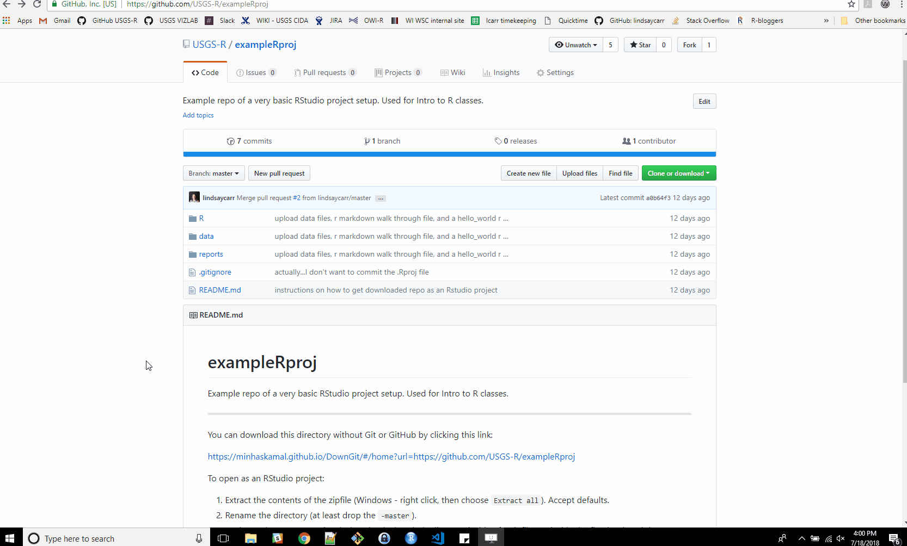

# exampleRproj
Example repo of a very basic RStudio project setup. Used for Intro to R classes.

----

You can download this directory without Git or GitHub by clicking this link:

https://minhaskamal.github.io/DownGit/#/home?url=https://github.com/USGS-R/exampleRproj

To open as an RStudio project:

1. Extract the contents of the zipfile (Windows - right click, then choose `Extract all`). Choose the folder you would like to extract the contents to. Note that this will create a folder called `exampleRproj-master` in the location you specify.
1. Rename the directory (at least drop the `-master`). 
1. Go to RStudio and click `File`, then `New Project...`.
1. Select `Existing Directory`.
1. Click `Browse` and find your downloaded and unzipped folder.
1. Finally, click `Create Project`.

Here is a video walk-through of how to do the steps above:

  

